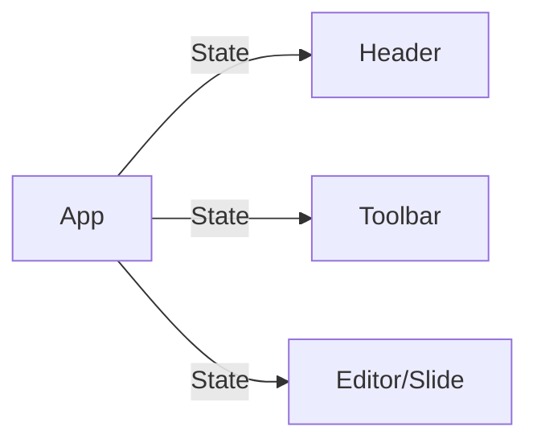

# Welcome!

Hi! I'm your first Amanjot Singh, a **Full Stack Developer**.

# About project
In this i have tried cloning of google slides.
This project is build with [Reactjs](https://reactjs.org/).

>  Before starting the project make sure you installed following dependencies  [NPM](https://www.npmjs.com/get-npm)  on your machine 

To start the project  go to root of the project and install dependenices mentioned in the package.json using command `npm i` and after that use command `npm run start` or `npm start`

## Data Flow
 Data Flow/ App structure

# Features add

## Add slides

Feature is used to add slides a to the view

- Coverted positives flows
 - Featue is stable

## Print Slides/Export a file

This will help to convert slides into PDF and print media by removing header and side toolbar 

- Completed postive flow
- Feature is stable

## Add Images

This feature will help user to add images to the active slides

-Feature: unstable when slides are dragged
- Status: incomplete

## Add Text fields

This feature will help user to add text fields to the active slides

 - Feature: stable
 - Status: incomplete 
 - 
## Delete a Slide

You can delete the any slide by clicking the **x** button in the sidebar.

#

>   [  Cheers || ;->  |END| ]